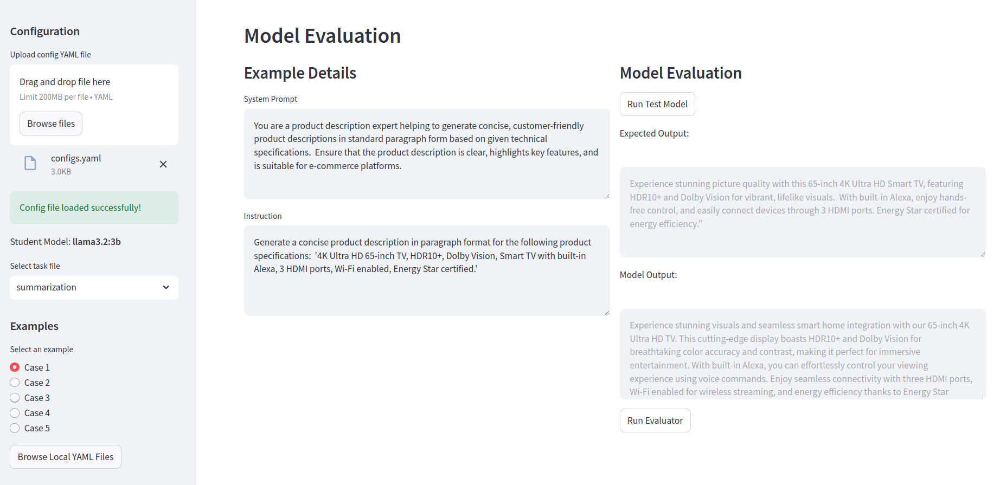

# LLMEvalForge: Model Evaluation Framework

**LLMEvalForge** is a Python framework designed to automate the evaluation of Large Language Models (LLMs) in custom domains. It enables the creation of tailored test suites to assess models on specific tasks, domains, or ethical considerations. 

# Table of Contents

1. [Introduction](#introduction)
2. [Installation Instructions](#installation-instructions)
   - [Prerequisites](#prerequisites)
   - [Setting Up the Environment](#setting-up-the-environment)
   - [Running the Application](#running-the-application)
3. [Files Overview](#files-overview)
4. [Configuration Details](#configuration-details)
5. [Usage Examples](#usage-examples)
   - [Quick Start Guide](#quick-start-guide)
   - [Sample Configurations](#sample-configurations)
6. [Troubleshooting](#troubleshooting)
7. [Contributing](#contributing)
8. [Contact and Support](#contact-and-support)
9. [License](#license)

# 1. Installation Instructions

- Python version required: `python 3.10.12`

- Dependencies: `pip install -r requirements.txt`

- Running the web app: `streamlit run app.py`
(check section 2.2 How to use the web app)

- Usage to run pipeline:

`python main.py --config <path_to_config file: config.yaml> --output <directory to save results of test>`


# 2. Files

- `main.py`: this file serves as the core script for running evaluations on language models. It orchestrates the entire process from loading configurations to executing tasks and saving results.

- `configs.yaml`: this `YAML` file contains configuration settings for the evaluation process. It specifies:

- `app.py`: this file is a Streamlit application that provides a user interface for running model evaluations interactively. The app is designed to make the evaluation process more accessible and user-friendly, allowing for real-time interaction and visualization of results.

- `model_handler/evaluators.py`: this module likely contains the run_evaluation function, which is responsible for evaluating the model's responses. It uses a high-performing language model to compare the test model's output against expected responses, assigning scores and providing feedback.

- `task_handler/summarization.py`: this module contains the `run_summarization_task` function, which executes the summarization task. It processes the input data, runs the model, and returns the model's output for evaluation.

- `prompt_library/evaluator_prompt.yaml`: this file contains the `system_prompt` and `user_prompt`. 


## 2.1 configs.yaml

The config file has the following keys:

- evaluation_tasks: Lists tasks with their dataset files and parameters. In particular, the name of the task and the associated yaml file with the examples to assess the model. The path to the YAML file (`custom_tasks/summarization_ecommerce_tests.yaml`) that contains the dataset and parameters for the summarization evaluation. The value of `requires_eval` is to determine if the test requires evaluation or not: for example an inference speed wouldn't require an evaluation of the candidate model.

- candidate_model: Defines the model to be evaluated, including its module, class, and parameters. The provided configuration file defines parameters for using a candidate model in the `langchain_community.llms` module, specifically the `Ollama` class. The model used is `llama3.2:3b-instruct-fp16`, which is likely a 3-billion-parameter instruction-tuned version of the Llama model using half-precision (fp16) for efficiency. The `temperature` parameter is set to 0, meaning the model will produce deterministic outputs, and `num_predict` is set to 600, likely indicating the maximum token length for predictions. This setup is optimized for precise and controlled text generation.

- evaluator: Configures the evaluator model, including API key source, model parameters, and prompts. This section of the config file defines the settings for an evaluator named `chatgpt_evaluator`. It specifies that the API key is sourced from the environment (`env`) and that the GPT-4 model is used with a `temperature` of 0, ensuring deterministic outputs. The evaluator uses a set of prompts stored in the `prompt_library/evaluator_prompts.yaml` file and applies the `NumericalScorer` to score the outputs. This setup likely facilitates structured evaluation and scoring of responses generated by GPT-4 based on predefined prompts.

<details>
<summary>config.yaml</summary>

```
evaluation_tasks:
  summarization:
    dataset_file: custom_tasks/summarization_ecommerce_tests.yaml
    requires_eval: true

candidate_model:
  module: langchain_community.llms
  class: Ollama
  params:
    model: llama3.2:3b-instruct-fp16
    temperature: 0
    num_predict: 600

evaluator:
  name: chatgpt_evaluator
  api_key_source: env  # Can be 'env' or 'file'
  model_params:
    model_name: gpt-4o
    temperature: 0
  prompt_file: prompt_library/evaluator_prompts.yaml  
  scorer: NumericalScorer
```
</details>

Users can customize the config file by adding more tests. At the moment, **LLMEvalForge** only allows to test candidate models with *ollama* framework. 


## 2.2 How to use the webapp

The web application uses streamlit and can be run with:

`streamlit run app.py`

The webapp is designed to evaluate the performance of a model in generating concise product descriptions from technical specifications. 

Here's a breakdown of how it works:



<details>
  <summary>Click to see more</summary>

### A. Configuration Section (left panel)

- `Upload config YAML file`: This allows you to upload a **configuration file** (in YAML format) that contains the parameters and settings for the model you want to evaluate.
In the image, the `configs.yaml` file has already been loaded successfully.

- **Student Model**: The selected model for evaluation is `llama3.2:3b-instruct-fp16`, which indicates that the model is likely a version of the LLaMA language model. You can select the model to be evaluated from this dropdown menu.

- **Select task file**: This dropdown allows you to select the type of task the model will perform. In this case, "summarization" has been selected, indicating that the model will be evaluated on its ability to summarize or condense information. This section offers different predefined test cases (Case 1 to Case 5) to evaluate the model. The user can select a case to test the model's capabilities on that specific example. In this image, "Case 1" is selected.

Another option is to use "random".


### B. Candidate Model Inference (right panel)

- `System Prompt`: this is the prompt given to the candidate model to guide its behavior. Here, the model is instructed to act as a product description expert, generating clear and customer-friendly product descriptions based on the specifications provided.

- `Instruction`: this specifies the task the model needs to perform. In this example, the instruction is to generate a concise product description for a 65-inch 4K Ultra HD TV with specific features like HDR10+, Dolby Vision, Alexa, HDMI ports, and Energy Star certification.

- `Run Candidate Model`: click this button to run the candidate model on the selected task and generates output based on the provided instruction `model_output`, and also show a text box for the `expected Output`.

- `expected output`: this field shows the ideal output the candidate model should generate. 

### Output evaluation

- `Run Evaluator` Button: click the the button to evaluate the quality of the generated output based on the expected output or specific evaluation metrics. This will show the score and also feedback of the model evaluator.
</details>

# 3. Evaluation Tests

## 3.1 Writing an evaluation task

Let's use the example of summarization capability as an example.

```
- case_id: 001
  category: Summarization
  sub_category: Product Information Understanding and Generation
  system_prompt: >
    You are a product description expert helping to generate concise, customer-friendly product descriptions in standard paragraph form based on given technical specifications. 
    Ensure that the product description is clear, highlights key features, and is suitable for e-commerce platforms.
  instruction: >
    Generate a concise product description in paragraph format for the following product specifications: 
    '4K Ultra HD 65-inch TV, HDR10+, Dolby Vision, Smart TV with built-in Alexa, 3 HDMI ports, Wi-Fi enabled, Energy Star certified.'
  expected_response: >
    Experience stunning picture quality with this 65-inch 4K Ultra HD Smart TV, featuring HDR10+ and Dolby Vision for vibrant, lifelike visuals. 
    With built-in Alexa, enjoy hands-free control, and easily connect devices through 3 HDMI ports. Energy Star certified for energy efficiency."
  potential_challenges: null
  difficulty_level: easy
```

- `case_id`: A unique identifier for the test case. This helps track and organize different test cases within the evaluation.

- `category`: The general task category being tested, here it is “Summarization”, indicating that the test is related to summarizing information.

- `sub_category`: A more specific classification within the category, which in this case is "Product Information Understanding and Generation," focusing on summarizing product details.

- `system_prompt`: The initial setup or role assigned to the candidate model, giving context for the task (e.g., generating product descriptions).

- `instruction`: A specific task for the candidate model, detailing what needs to be done based on provided inputs (e.g., creating a description from technical specs).

- `expected_response`: A sample ideal response that the candidate model should generate, giving evaluators a reference for correct output.

- `potential_challenges`: Identifies potential difficulties or common errors the candidate model might face, though it's null here.

- `difficulty_level`: Describes the expected difficulty level of the task, useful for designing a well-rounded evaluation set. The value can be "easy", "medium", "hard".

## 3.2 List of tests

### 3.2.1 Summarization

- **Objective**: Test the model's ability to condense information while retaining key details, coherence, and meaning.
- **Implementation**:
  - Provide the model with lengthy text passages and assess the quality of its summaries.
  - Use a `run_summarization_test` function that checks for completeness, brevity, and retention of key details.
  - Requires a `summarization_test_set.yaml` file with various text examples for testing different summary lengths and complexities.

### 3.2.2 Contextual Understanding

- **Objective**: Test the model's ability to understand and use context from previous interactions.
- **Implementation**:
  - Create a series of interconnected prompts.
  - Use a `run_contextual_test` function to evaluate the model's responses.
  - Requires a `contextual_test_set.yaml` file with specific tests.

### 3.2.3 Fact-checking and Source Verification

- **Objective**: Assess the model's ability to verify facts and suggest reliable sources.
- **Implementation**:
  - Add examples to the dataset for fact-checking.
  - Update `configs.yaml` with fact-checking instructions.
  - Modify `eval.py` to include `evaluate_fact_checking`.


### 3.2.4 Consistency Testing

- **Objective**: Evaluate the model's consistency in responses to similar questions.
- **Implementation**:
  - Add consistency examples to the dataset.
  - Update `configs.yaml` for consistency testing.
  - Modify `eval.py` to include `evaluate_consistency` and `calculate_similarity`.


### 3.2.5 Context Retention

- **Objective**:Test the model's ability to retain and accurately apply information from earlier parts of a conversation or text in later responses.
- **Implementation**:
  - Provide a series of prompts where important information is introduced early and referenced in later prompts.
  - Use a `run_context_retention_test` function to evaluate the model’s consistency and accuracy in recalling and applying the earlier information.
  - Requires a `context_retention_test_set.yaml` file with structured sequences of prompts that progressively build on prior context.

### 3.2.6 Additional Evaluation Ideas

In addition to Context Retention, Summarization etc..., various other tests can be developed to evaluate a language model's capabilities across a wide range of tasks. Below are a few examples:

- **Multilingual Proficiency**: Test understanding and response generation in multiple languages.
- **Abstraction and Generalization**: Assess the application of learned concepts to new scenarios.
- **Emotional Intelligence**: Evaluate recognition and response to emotional cues.
- **Code Generation and Debugging**: Test proficiency in writing and debugging code.
- **Multimodal Understanding**: If applicable, assess reasoning across text and images.
- **Adversarial Robustness**: Test performance against adversarial inputs.
- **Bias Detection and Mitigation**: Evaluate bias recognition and mitigation.
- **Task Adaptation**: Assess adaptation to new tasks with minimal instruction.
- **Long-term Dependency Handling**: Test coherence in long contexts.
